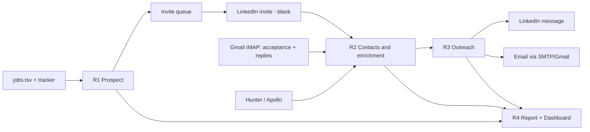

# fillow Reach — PRD & Data Schema

**Status:** Draft v0.3 · **Date:** 2026-10-01 · **Owner:** Taksha Thosani **Working name:** fillow Reach (a second agent family inside the fillow repo, sharing its config, libs, gates and dashboard) **Product constraints (v0.2):** free to run, open source, and portable: every user runs their own install with their own accounts and keys. Nothing in the code or defaults is tied to the author's accounts.

---

## 1. Summary

fillow Reach finds the *most relevant* recruiters, hiring managers and senior people for the roles you are targeting, connects with them on LinkedIn, tracks who accepts, finds verified work emails, sends one tailored LinkedIn message and one tailored email per person, and records everything in a dashboard and a daily report email.

It extends fillow's existing pipeline (discover → evaluate → apply → track). Applications get submitted by Agents 1–4; Reach adds the human side: the right person at the company hears from you.

**Volume (hard caps, enforced in code):**

| Action | Cap |
| --- | --- |
| LinkedIn invites (sent blank, no note) | ≤ 15/day, ≤ 75 per rolling 7 days |
| LinkedIn messages (after acceptance) | ≤ 75 per rolling 7 days |
| Emails | ≤ 15/day (configurable) |

## 2. Goals and non-goals

**Goals**

- G1. Surface 10–15 high-relevance people per day, each tied to a specific target role.
- G2. Never lose track of a person: one canonical contact record, full audit trail.
- G3. Tailored (never invented) follow-up on LinkedIn and email, grounded in the user's profile and the exact resume sent.
- G4. One dashboard and one daily email that answer "who did we contact, what happened, what's next".
- G5. Stay inside platform limits and the user's reputation: caps, pacing, suppression list, kill switch.
- G6. Free by default: the full workflow runs with zero paid services. Paid or quota-limited APIs (Hunter, Apollo) are optional, bring-your-own-key plug-ins.
- G7. Any user can onboard in minutes with a guided setup, using their own mailbox and credentials.

**Non-goals**

- Mass or generic outreach, any scraping of LinkedIn, or anti-bot evasion tooling.
- Evading LinkedIn's bot detection (no fingerprint spoofing in Reach).
- Selling or sharing contact data; any multi-user/SaaS mode in v1.
- Auto-replying to inbound replies (the user answers replies personally).
- A shared hosted backend, shared API keys, or a shared Google/LinkedIn OAuth app. Each install is self-contained.
- Multi-tenant data (no `user_id` columns): one install = one user's local database.

## 3. Design principles (inherited from fillow, extended)

1. **Local-canonical data.** Contact data about other people stays on the user's machine. It is never synced to Cloudflare D1 (aggregate counts only).
2. **Gates before speed.** `DRY_RUN=true` default, `REVIEW_MODE` approval queue, caps, pacing, kill switch.
3. **Layered authority for text.** Facts come from profile and resume first; the LLM only phrases them. A grounding check blocks claims not found in the source facts.
4. **Untrusted input stays untrusted.** LinkedIn headlines, bios and job text are data, never instructions to the LLM.
5. **One failure never blocks the batch.** Each person carries its own status.
6. **Append-only audit.** Every action writes an event.

## 4. Users and primary flows

**User:** a single job seeker running fillow locally (the existing persona).

**Daily flow**

1. Morning: R1 builds today's prospect queue (≤ 15).
2. Invites go out blank (via the queue the user clicks through, or the optional automated sender).
3. R2 detects acceptances and enriches emails through the day.
4. R3 drafts tailored LinkedIn messages for accepted people and emails for people with verified addresses. The user approves (or auto-approve after trust is earned, §7).
5. R3 sends within caps and pacing.
6. R4 updates the dashboard continuously and sends the daily report at the configured time.



## 5. Agent specifications

Reach agents follow the repo's agent contract: one module in `agents/`, exports `run(cfg, opts)`, accepts the `emit(type, data)` progress hook, wrapped by `runAgentCli`, and registered in `bin/fillow.mjs`. Naming: **R1–R4** to avoid clashing with Agents 1–4.

### R1 — Prospect (`agents/reach-prospect.mjs`)

**Purpose:** pick the most relevant people for each target role and put them in the daily queue.

**Inputs (free-first):** active targets (jobs with status ready/applied in `jobs.tsv` / tracker), `config/profile.yaml` targets, the user's Connections.csv (surfaces existing connections at target companies), names on job postings and company team pages, profile URLs the user pastes in. Optional: Apollo/Hunter people search with the user's own key (R1-8 to R1-10). Without a people-search API, discovery is narrower and more manual; this is a known free-tier limitation.

**Outputs:** rows in `person`, `person_target`, `connection(status='queued')`.

| ID | Requirement |
| --- | --- |
| R1-1 | Find candidates per target company by persona: recruiter, hiring manager (title match to team/role), senior IC on the target team, executive (only for small companies). |
| R1-2 | Score relevance 0–100 with stored reasons (title match, same team, seniority, recency of activity, company is a live target). Queue only score ≥ `min_relevance`. |
| R1-3 | Dedup on normalized LinkedIn URL, then email, then fuzzy name+company. |
| R1-4 | Skip: blacklisted companies, suppressed people, existing connections, anyone invited in the last 90 days. |
| R1-5 | Cap the daily queue at `invites_per_day`; also respect the rolling 7-day cap (§7). |
| R1-6 | Sender modes: `queue` (default): the dashboard shows each profile with a one-click open and a "mark sent" button; `bsk` (opt-in, deferred to M5; v1 ships `queue` only): sends blank invites through the user's logged-in session via the existing bsk integration, with random pacing, behind `linkedin.send_mode: bsk`. |
| R1-7 | Auto-pause on any LinkedIn warning, captcha, restriction notice or unexpected page (bsk mode). |
| R1-8 | Paste import: `fillow reach import --paste` parses text the user copied from LinkedIn search results or a company page into name, title, company and profile URL. The user reviews the parsed rows before they enter the queue. Nothing automated touches LinkedIn. |
| R1-9 | Public-pages source: for company team/about pages and job postings the user lists, fetch with plain HTTP or the repo's Playwright, respect robots.txt and rate limits, no login, no fingerprint spoofing; skip pages that block automated access. |
| R1-10 | Own-key providers: Apollo/Hunter people search runs only if the user configured a key and quota remains. Results are tagged with their source, cached, and counted in `provider_usage`. A provider that errors or runs out of quota is skipped for the run, never fatal. |

**Notes:** Supabase's LinkedIn login proves identity only; it cannot read connections or send invites, so it is not used for data access.

### R2 — Contacts and Enrichment (`agents/reach-contacts.mjs`)

**Purpose:** the system of record for people; detects acceptances; finds and verifies emails.

| ID | Requirement |
| --- | --- |
| R2-1 | Detect accepted invites, in order: (a) LinkedIn "accepted your invitation" notification emails via Gmail IMAP (reuses `lib/gmail.mjs` pattern); (b) Connections.csv import; (c) bsk check of the invitations/connections page (opt-in). Set `connection.status='accepted'`. |
| R2-2 | Enrich emails through a provider interface (`lib/reach-providers/`): built-in free steps (infer the company's address pattern from known addresses, DNS MX check) plus optional plug-ins with the user's own key (Hunter, Apollo). Inferred addresses are `unknown` until verified; with `require_verified: true` they are never emailed. Spend free-tier credits on verification of the highest-relevance people first. |
| R2-3 | Store every address with source, confidence, verification status and timestamp. Only `valid` (and optionally `accept_all` flagged) addresses are eligible for sending. |
| R2-4 | Respect provider quotas; stop gracefully and mark `unknown` when exhausted. Cache results to avoid paying twice. |
| R2-5 | Detect bounces and replies from Gmail; mark address `invalid` on hard bounce and add to suppression. |
| R2-6 | Maintain the suppression list (opt-outs, bounces, manual). Suppression always wins. |
| R2-7 | Retention: purge declined / no-response persons after `retention_days` (default 180), keeping aggregate stats. |

### R3 — Outreach (`agents/reach-outreach.mjs`)

**Purpose:** draft and send one tailored LinkedIn message and one tailored email per person, within caps.

| ID | Requirement |
| --- | --- |
| R3-1 | Trigger LinkedIn message when `connection.status='accepted'` and no prior message exists. |
| R3-2 | Trigger email when a verified address exists, `email_delay_days` (default 2) have passed since the LinkedIn message, and the person has not replied. Reply on either channel cancels all pending drafts. |
| R3-3 | Drafts use only: the person's role/company, the target role (title, key requirements), user profile facts, and the resume variant sent for that job. Record the exact resume (`resume_asset`) tied to that role; attachment timing follows `email.attach_resume` (default `followup`: not on the first cold email). |
| R3-4 | Grounding check: every factual claim in the draft must trace to profile/resume text; failures set `grounding_ok=0` and block sending. |
| R3-5 | Email includes a plain-text opt-out line and the sender's real name; honors suppression. |
| R3-6 | Max touches per person: 1 LinkedIn message, 1 email, 1 email follow-up (step 2) after `followup_days` (default 7) of silence. Then stop. |
| R3-7 | Approval modes: `review` (every draft approved by the user), `sample` (user approves the first N, then auto-sends with random audits), `auto` (only after N consecutive approvals without edits). Default `review`. |
| R3-8 | Send LinkedIn messages via the same sender mode as R1 (v1: `queue`); send email through the user's own mailbox over SMTP, with host/port/credentials configurable (Gmail preset first). Randomized delays between sends. |
| R3-9 | Never email and DM the same person on the same day. |

### R4 — Report and Dashboard (`agents/reach-report.mjs`)

| ID | Requirement |
| --- | --- |
| R4-1 | Dashboard (a "Reach" tab in the existing local `--ui` console): pipeline funnel, per-person timeline, approval queue, usage versus caps, error list. |
| R4-2 | Daily report email at `report.time` (local timezone) via `fillow cron`. |
| R4-3 | Report contents per person touched that day: name, role, company, LinkedIn status, email status, message sent (first lines), reply status, resume sent. Attach the resume PDFs sent that day (or link to the dashboard if over a size limit). |
| R4-4 | Report header: counts versus caps, acceptance rate (14-day), reply rate, bounce rate, errors, tomorrow's queue size. |
| R4-5 | Hosted Cloudflare dashboard (optional) receives **aggregate counts only**, never names, emails or message bodies. |

## 6. Data model

SQLite at `data/reach.db` (gitignored). It is the source of truth for Reach, with a nightly append-only export to `data/reach/events-YYYYMMDD.jsonl` so the data survives a corrupted database. Driver: Node's built-in `node:sqlite` (free, no native dependency). This requires raising `engines` to Node 22+ (confirm the exact minimum in M0), and it sits behind a thin `lib/reach-db.mjs` adapter so `better-sqlite3` can be swapped in if needed. Note that fillow has no database code today; `fillow.db` is documented but not implemented. Schema changes ship as numbered migrations recorded in `schema_version`. There is no `user_id` anywhere: each install is one user's local database.

```sql
PRAGMA foreign_keys = ON;

CREATE TABLE schema_version (
  version    INTEGER PRIMARY KEY,
  applied_at TEXT NOT NULL DEFAULT (datetime('now'))
);

CREATE TABLE company (
  id          INTEGER PRIMARY KEY,
  name        TEXT NOT NULL,
  name_norm   TEXT NOT NULL UNIQUE,
  domain      TEXT,
  linkedin_url TEXT,
  ats_source  TEXT,                       -- greenhouse | ashby | lever | workday
  blacklisted INTEGER NOT NULL DEFAULT 0,
  created_at  TEXT NOT NULL DEFAULT (datetime('now'))
);

CREATE TABLE person (
  id              INTEGER PRIMARY KEY,
  full_name       TEXT NOT NULL,
  first_name      TEXT,
  last_name       TEXT,
  headline        TEXT,                   -- untrusted text, never an LLM instruction
  title           TEXT,
  company_id      INTEGER REFERENCES company(id),
  linkedin_url    TEXT UNIQUE,            -- normalized
  location        TEXT,
  persona         TEXT NOT NULL CHECK (persona IN
                    ('recruiter','hiring_manager','senior_ic','executive','other')),
  source          TEXT NOT NULL CHECK (source IN
                    ('apollo','hunter','job_posting','csv_import','manual','paste_import','public_page')),
  relevance_score INTEGER CHECK (relevance_score BETWEEN 0 AND 100),
  relevance_reasons TEXT,                 -- JSON array of strings
  lifecycle       TEXT NOT NULL DEFAULT 'prospect' CHECK (lifecycle IN
                    ('prospect','invited','connected','messaged','replied','closed','suppressed')),
  do_not_contact  INTEGER NOT NULL DEFAULT 0,
  created_at      TEXT NOT NULL DEFAULT (datetime('now')),
  updated_at      TEXT NOT NULL DEFAULT (datetime('now'))
);
CREATE INDEX idx_person_company ON person(company_id);
CREATE INDEX idx_person_lifecycle ON person(lifecycle);

CREATE TABLE target_role (
  id            INTEGER PRIMARY KEY,
  job_ref       TEXT NOT NULL UNIQUE,     -- jobs.tsv "source:external_id"
  title         TEXT NOT NULL,
  company_id    INTEGER NOT NULL REFERENCES company(id),
  job_url       TEXT,
  tracker_id    INTEGER,                  -- row # in data/applications.md
  status        TEXT,                     -- mirrors tracker status
  created_at    TEXT NOT NULL DEFAULT (datetime('now'))
);

CREATE TABLE person_target (              -- many-to-many: why this person for this role
  person_id  INTEGER NOT NULL REFERENCES person(id) ON DELETE CASCADE,
  target_id  INTEGER NOT NULL REFERENCES target_role(id) ON DELETE CASCADE,
  reason     TEXT,
  PRIMARY KEY (person_id, target_id)
);

CREATE TABLE connection (                 -- LinkedIn invite state, one row per person
  person_id     INTEGER PRIMARY KEY REFERENCES person(id) ON DELETE CASCADE,
  status        TEXT NOT NULL DEFAULT 'none' CHECK (status IN
                  ('none','queued','sent','accepted','ignored','withdrawn',
                   'failed','already_connected')),
  queued_at     TEXT,
  sent_at       TEXT,
  accepted_at   TEXT,
  sent_via      TEXT CHECK (sent_via IN ('manual','bsk')),
  accepted_via  TEXT CHECK (accepted_via IN
                  ('notification_email','csv_import','bsk','manual')),
  last_checked_at TEXT,
  error         TEXT
);
CREATE INDEX idx_conn_sent ON connection(sent_at);

CREATE TABLE email_address (
  id            INTEGER PRIMARY KEY,
  person_id     INTEGER NOT NULL REFERENCES person(id) ON DELETE CASCADE,
  email         TEXT NOT NULL,
  source        TEXT NOT NULL CHECK (source IN ('hunter','apollo','manual','pattern')),
  confidence    INTEGER,                  -- provider score 0-100
  verification  TEXT NOT NULL DEFAULT 'unknown' CHECK (verification IN
                  ('valid','invalid','accept_all','risky','unknown')),
  verified_at   TEXT,
  is_primary    INTEGER NOT NULL DEFAULT 0,
  provider_ref  TEXT,
  created_at    TEXT NOT NULL DEFAULT (datetime('now')),
  UNIQUE (person_id, email)
);

CREATE TABLE resume_asset (               -- exact resume sent, for the daily report
  id         INTEGER PRIMARY KEY,
  job_ref    TEXT,
  path       TEXT NOT NULL,               -- data/tailored/...pdf
  sha256     TEXT NOT NULL,
  created_at TEXT NOT NULL DEFAULT (datetime('now'))
);

CREATE TABLE template (
  id      INTEGER PRIMARY KEY,
  kind    TEXT NOT NULL CHECK (kind IN ('linkedin_dm','email_first','email_followup','invite_note')),
  name    TEXT NOT NULL,
  version INTEGER NOT NULL DEFAULT 1,
  body    TEXT NOT NULL,
  UNIQUE (kind, name, version)
);

CREATE TABLE message (
  id            INTEGER PRIMARY KEY,
  person_id     INTEGER NOT NULL REFERENCES person(id) ON DELETE CASCADE,
  target_id     INTEGER REFERENCES target_role(id),
  channel       TEXT NOT NULL CHECK (channel IN ('linkedin','email')),
  direction     TEXT NOT NULL DEFAULT 'out' CHECK (direction IN ('out','in')),
  step          INTEGER NOT NULL DEFAULT 1,       -- 1 first touch, 2 follow-up
  status        TEXT NOT NULL CHECK (status IN
                  ('draft','needs_approval','approved','queued','sent',
                   'failed','bounced','replied','cancelled')),
  subject       TEXT,
  body          TEXT NOT NULL,
  template_id   INTEGER REFERENCES template(id),
  resume_asset_id INTEGER REFERENCES resume_asset(id),
  model         TEXT,
  grounding_ok  INTEGER,                          -- 1 pass, 0 blocked
  grounding_notes TEXT,
  approved_by   TEXT,                             -- 'user' | 'auto'
  approved_at   TEXT,
  scheduled_for TEXT,
  sent_at       TEXT,
  provider_ref  TEXT,                             -- SMTP message-id
  thread_ref    TEXT,                             -- Gmail thread id
  reply_class   TEXT CHECK (reply_class IN
                  ('positive','neutral','not_now','negative','auto_reply','unsubscribe')),
  error         TEXT,
  created_at    TEXT NOT NULL DEFAULT (datetime('now'))
);
CREATE INDEX idx_msg_sent ON message(channel, sent_at)
  WHERE direction = 'out' AND status = 'sent';
CREATE INDEX idx_msg_person ON message(person_id);

CREATE TABLE provider_usage (             -- quota tracking for the user's own API keys
  provider TEXT NOT NULL,                 -- hunter | apollo
  month    TEXT NOT NULL,                 -- YYYY-MM
  calls    INTEGER NOT NULL DEFAULT 0,
  PRIMARY KEY (provider, month)
);

CREATE TABLE enrichment_cache (           -- never pay twice for the same lookup
  provider   TEXT NOT NULL,
  query_key  TEXT NOT NULL,               -- e.g. 'email_finder:jane|doe|acme.com'
  response   TEXT NOT NULL,               -- JSON
  fetched_at TEXT NOT NULL DEFAULT (datetime('now')),
  PRIMARY KEY (provider, query_key)
);
-- API keys are never stored in the database; they live only in .env.

CREATE TABLE suppression (
  id         INTEGER PRIMARY KEY,
  kind       TEXT NOT NULL CHECK (kind IN ('email','linkedin_url','domain')),
  value      TEXT NOT NULL,
  reason     TEXT NOT NULL CHECK (reason IN ('optout','bounce','manual','complaint')),
  added_at   TEXT NOT NULL DEFAULT (datetime('now')),
  UNIQUE (kind, value)
);

CREATE TABLE run (
  id          INTEGER PRIMARY KEY,
  agent       TEXT NOT NULL,                      -- prospect | contacts | outreach | report
  started_at  TEXT NOT NULL DEFAULT (datetime('now')),
  finished_at TEXT,
  status      TEXT CHECK (status IN ('running','ok','partial','failed','paused')),
  dry_run     INTEGER NOT NULL DEFAULT 1,
  stats       TEXT                                -- JSON
);

CREATE TABLE report (
  id        INTEGER PRIMARY KEY,
  report_date TEXT NOT NULL UNIQUE,
  path      TEXT,
  sent_at   TEXT,
  status    TEXT CHECK (status IN ('built','sent','failed'))
);

-- Append-only audit trail: who did what, when, and why
CREATE TABLE event_log (
  id        INTEGER PRIMARY KEY,
  ts        TEXT NOT NULL DEFAULT (datetime('now')),
  run_id    INTEGER REFERENCES run(id),
  agent     TEXT NOT NULL,
  entity    TEXT NOT NULL,                        -- person | message | connection | email_address
  entity_id INTEGER,
  action    TEXT NOT NULL,
  detail    TEXT                                  -- JSON
);
CREATE TRIGGER event_log_no_update BEFORE UPDATE ON event_log
  BEGIN SELECT RAISE(ABORT, 'event_log is append-only'); END;
CREATE TRIGGER event_log_no_delete BEFORE DELETE ON event_log
  BEGIN SELECT RAISE(ABORT, 'event_log is append-only'); END;

-- Rolling-window usage, read by every sender before it sends
CREATE VIEW v_usage_7d AS
  SELECT 'invite' AS action, COUNT(*) AS used FROM connection
    WHERE sent_at >= datetime('now','-7 days')
  UNION ALL
  SELECT 'linkedin_message', COUNT(*) FROM message
    WHERE channel='linkedin' AND direction='out' AND status='sent'
      AND sent_at >= datetime('now','-7 days')
  UNION ALL
  SELECT 'email', COUNT(*) FROM message
    WHERE channel='email' AND direction='out' AND status='sent'
      AND sent_at >= datetime('now','-7 days');
```

### State machines

**Person lifecycle:** `prospect → invited → connected → messaged → replied → closed`; `suppressed` is reachable from any state and is terminal.

**Connection:** `none → queued → sent → accepted | ignored | withdrawn | failed`; `already_connected` is set at queue time. Ignored invites older than 30 days may be withdrawn to keep the pending list clean.

**Message:** `draft → needs_approval → approved → queued → sent → replied | bounced`; any state → `cancelled` when the person replies or is suppressed; `failed` is retryable at most twice.

### Data lifecycle

- Contact data: local only; export, delete-by-person and purge commands (`fillow reach forget <person>`).
- `event_log` is never edited; deleting a person pseudonymizes the event rows' details.
- Daily JSONL export is gitignored.

## 7. Rate limits, pacing and health guard

- **Counters** are computed from timestamps in a rolling window (`v_usage_7d`, plus a 1-day variant), never from calendar weeks. Every sender checks the counter *at send time*, inside the same transaction that records the send.
- **Over cap:** items stay `queued` and roll to the next day; they never fail.
- **Pacing:** randomized delay between sends (`pace_seconds` min/max), working-hours window, no bursts.
- **Health guard:** the 14-day invite acceptance rate and email bounce rate are monitored. If acceptance falls below `min_acceptance` (default 25%) or bounce rate exceeds `max_bounce` (default 3%), Reach halves the daily targets and flags it in the report; a hard bounce rate over 5% pauses email.
- **Kill switch:** the file `data/reach/PAUSE` stops all sending immediately; the dashboard has the same button. Any detected LinkedIn warning/captcha in bsk mode creates it automatically.
- **Trust ramp for approvals:** `review` → `sample` → `auto`, promotion only after `N` consecutive approvals with no edits, demotion on any grounding failure.

Reported public figures for free-account LinkedIn limits (about 100 invites and about 100 messages per rolling week) come from third-party vendor sources; LinkedIn does not publish exact numbers. Reach's own caps (75/week) leave headroom and should be re-checked periodically.

## 8. Configuration

Added under `reach:` in `config/profile.yaml`; env vars override, as with existing runtime settings.

```yaml
reach:
  enabled: true
  dry_run: true                 # env REACH_DRY_RUN; nothing is sent while true
  approval_mode: review         # review | sample | auto
  min_relevance: 70
  personas: [recruiter, hiring_manager, senior_ic]
  limits:
    invites_per_day: 15
    invites_per_7d: 75
    linkedin_messages_per_7d: 75
    emails_per_day: 15
    pace_seconds: [45, 180]
    working_hours: "08:00-18:00"
  linkedin:
    send_mode: queue            # queue | bsk
    invite_note: false          # invites are sent blank
  mail:                         # the user's own mailbox; set by `fillow reach setup`
    preset: gmail               # gmail | custom
    imap: { host: imap.gmail.com, port: 993 }
    smtp: { host: smtp.gmail.com, port: 465 }
    # credentials come from .env, never from this file
  email:
    delay_days: 2
    followup_days: 7
    attach_resume: followup     # first | followup | never
    require_verified: true
    optout_line: "If you'd rather not hear from me, reply 'stop' and I won't write again."
  enrichment:
    order: [pattern, hunter, apollo]          # pattern = free built-in step
    monthly_quota: { hunter: 0, apollo: 0 }   # 0 = provider disabled; set from YOUR plan
  health: { min_acceptance: 0.25, max_bounce: 0.03 }
  retention_days: 180
  report: { time: "18:30", timezone: "America/Chicago", attach_resumes: true }
```

Secrets in `.env`: `REACH_MAIL_USER` and `REACH_MAIL_PASSWORD` (an app password; the existing `GMAIL_IMAP_USER` / `GMAIL_APP_PASSWORD` are read as a fallback), plus optional `HUNTER_API_KEY` and `APOLLO_API_KEY`.

## 9. Interfaces

**CLI** (registered in `bin/fillow.mjs`):

```
fillow reach setup                                       guided onboarding (see 9a)
fillow reach doctor                                      check mailbox, keys, caps, DB
fillow reach prospect | contacts | outreach | report     run a single agent
fillow reach run                                         full daily cycle
fillow reach status                                      usage vs caps, queue sizes, health
fillow reach approve [--all-grounded]                    review drafts
fillow reach pause | resume                              kill switch
fillow reach import --paste                              parse pasted search results (review first)
fillow reach import connections.csv                      LinkedIn export
fillow reach suppress <email|url>                        add to do-not-contact
fillow reach forget <person-id>                          delete a person
```

**Dashboard views:** Funnel (prospect → invited → accepted → messaged → replied); Today's queue; Approvals; People (timeline per person); Usage vs caps; Health; Errors.

**Daily report email:** header with counts and health, then one row per person touched: name, role and company, LinkedIn status, email status and verification, message preview, reply status, attached resume.

## 9a. Onboarding and open-source portability

`fillow reach setup` (extends the existing `fillow setup` wizard) walks a new user through:

1. **Mailbox:** choose the Gmail preset or enter custom IMAP/SMTP host and port; paste an app password into `.env`; the wizard tests IMAP read and a test SMTP send to the user's own address.
2. **Enrichment (optional):** paste Hunter and/or Apollo keys and the user's monthly quota, or skip and use the free path. Keys are checked with one test call, stored only in `.env`, and the wizard shows what each key unlocks (email finding, verification, people search).
3. **Caps and hours:** confirm the default limits; they can be lowered, and raising them past the defaults shows a warning.
4. **Acknowledgements:** the user confirms they are the sender and are responsible for complying with LinkedIn's terms and applicable email laws; `bsk` mode (when it exists) needs a separate, explicit acknowledgement.
5. **First import:** optionally load Connections.csv and a first set of target roles.

Portability requirements:

- No hardcoded accounts, hostnames or personal data in code, tests or committed examples; fixtures use fake data.
- The existing IMAP client hardcodes `imap.gmail.com` and must take host and port from config.
- `fillow reach doctor` is the single place to diagnose setup problems.
- No telemetry, consistent with fillow's current stance.
- Free to run: no hosted service is required; Cloudflare stays optional and aggregate-only.
- License: fillow is PolyForm Noncommercial, which fits a free tool; Reach inherits it.

**Mail access choices.** App passwords need Google 2-Step Verification, and some Workspace admins disable them, so `doctor` should explain a failure rather than just erroring. OAuth is not the default for a free open-source tool: as I understand Google's policy, a shared OAuth app that reads or sends Gmail mail would need Google's app verification (and for read access a security assessment), while each user creating their own OAuth client in testing mode has to re-authorize periodically. Check Google's current documentation before building an OAuth path; it is deferred past v1.

## 10. Integrations and constraints

| Integration | Use | Notes |
| --- | --- | --- |
| LinkedIn | Invites, messages, acceptance | No public API for these actions. `queue` mode is the default. `bsk` mode drives the user's own logged-in session; this conflicts with LinkedIn's User Agreement and risks restriction, so it is opt-in and the user accepts that risk. |
| Supabase Auth (LinkedIn OIDC) | Identity only | Cannot read connections or send invites. |
| Hunter (optional, user's own key) | Domain pattern, email finder, verifier | Free tier is small; used only for the highest-relevance people. Each user checks their own quota. |
| Apollo (optional, user's own key) | People search, enrichment | Some endpoints are plan-gated; verify before building against them. |
| Mailbox IMAP | Acceptance notifications, replies, bounces | Host/port configurable (Gmail preset). Notification emails depend on the user's LinkedIn email settings. |
| Mailbox SMTP | Sending email | Via `nodemailer` with the user's own app password in v1; OAuth deferred (see 9a). |

## 11. Security, privacy and compliance

- Contact data is personal data about third parties: stored locally, gitignored, never sent to D1 or other cloud stores except the provider calls needed for enrichment.
- LLM prompts receive the minimum fields; profile text from LinkedIn is wrapped as quoted data, with injection patterns stripped.
- Cold B2B email is generally permitted in the US with an accurate sender identity and a working opt-out (CAN-SPAM); the EU, UK and Canada are stricter. Reach ships with the opt-out line, suppression honored across all channels, and a region flag that disables email to recipients likely in stricter jurisdictions unless the user opts in.
- Honest messaging only: no fake mutual connections, no claimed referrals, no invented projects.
- In an open-source release the user is the sender and is responsible for how they use the tool; the setup acknowledgements and docs say so plainly.
- Fix first: the Cloudflare worker's unauthenticated read mode (see the earlier repo review) before any Reach data could touch it.

## 12. Risks and mitigations

| Risk | Mitigation |
| --- | --- |
| LinkedIn restricts the account | `queue` default; caps below reported limits; no evasion features; auto-pause on warnings; health guard on acceptance rate |
| Wrong or hallucinated claims in messages | Grounding check; approval modes; trust ramp with demotion |
| Bounces damage Gmail reputation | Verified-only sending; bounce guard; daily cap |
| Annoying a contact | One touch per channel plus one follow-up; no same-day DM and email; reply cancels everything |
| Enrichment cost or quota burn | Caching, quotas, order of providers |
| Acceptance detection breaks (email format change) | Three detection paths with CSV fallback |
| Prompt injection via profile text | Quote-and-strip, no tool access for the drafting model |
| Data loss | Nightly JSONL export of the event log |
| App passwords unavailable (2-Step off, Workspace policy) | `doctor` diagnoses it; custom IMAP/SMTP supported; OAuth path considered later |
| Free-tier discovery is thin | Connections.csv, job-posting names and manual adds; optional own-key Apollo/Hunter |

## 13. Success metrics

- Invite acceptance rate ≥ 40% (alert below 25%).
- Reply rate on first touch ≥ 10%, tracked per persona and per template version.
- Email hard-bounce rate \< 2%.
- Zero cap violations (a test asserts it).
- Zero messages sent with `grounding_ok = 0`.
- Time spent by the user per day \< 10 minutes (approvals plus invite clicks).
- Interviews or referrals attributed to Reach contacts (manual tag).

## 14. Milestones and acceptance criteria

| M | Scope | Done when |
| --- | --- | --- |
| M0 | Schema and migrations on `node:sqlite` behind an adapter, config block, usage view, kill switch, `fillow reach setup`/`doctor`/`status`, configurable IMAP host | A new user can onboard from a clean checkout; migrations apply; cap tests pass |
| M1 | R2 core: CSV import, acceptance detection from Gmail, Hunter email find + verify, suppression | A sample export imports; a test mailbox fixture flips `connection.status` to `accepted` |
| M2 | R1 prospecting (paste import, Connections.csv, public pages, own-key providers) + queue UI with manual "mark sent"; relevance scoring | 10–15 ranked people per day with stored reasons |
| M3 | R3 drafting, grounding check, approval queue, email sending via SMTP, reply/bounce handling | A dry run produces drafts; a sandbox send works; cancel-on-reply tested |
| M4 | R4 dashboard tab and daily report email with attachments | Report arrives at the set time with correct counts |
| M5 | Optional: bsk sender behind flag, `sample`/`auto` approval modes, health guard tuning | Auto-pause fires in a simulated warning page |

**Tests to add:** cap enforcement across the rolling window; grounding rejects an invented claim; suppression beats every other rule; one-touch-per-channel rules; same-day DM+email blocked; event_log immutability; retention purge.

## 15. Decisions log and remaining questions

**Decided (2026-10-01)**

1. Database: free SQLite via `node:sqlite` behind an adapter; fallback `better-sqlite3`.
2. Open source and portable: every user's own accounts and keys; guided onboarding; no shared backend.
3. LinkedIn sending: `queue` mode in v1; `bsk` deferred to M5 behind a flag.
4. Mailbox: user-configurable IMAP/SMTP (Gmail preset), app password in `.env`; OAuth deferred.
5. Resume: not attached to the first cold email; default attach on follow-up; setting available.
6. Referral-request variant: after M4, only when the tracker shows an application at that company, and it never claims a referral that doesn't exist.
7. LinkedIn discovery: no scraping of LinkedIn. Discovery uses paste import, Connections.csv, public company pages, and optional own-key Apollo/Hunter. Anti-bot evasion tools are out of scope.

**Still open**

1. Exact minimum Node version for `node:sqlite` without experimental flags (confirm in M0).
2. Which free people-discovery sources are reliable enough to ship as defaults (to be tested in M2).
3. Whether acceptance-notification emails are consistent enough across users' LinkedIn settings, or CSV import should be the primary path.